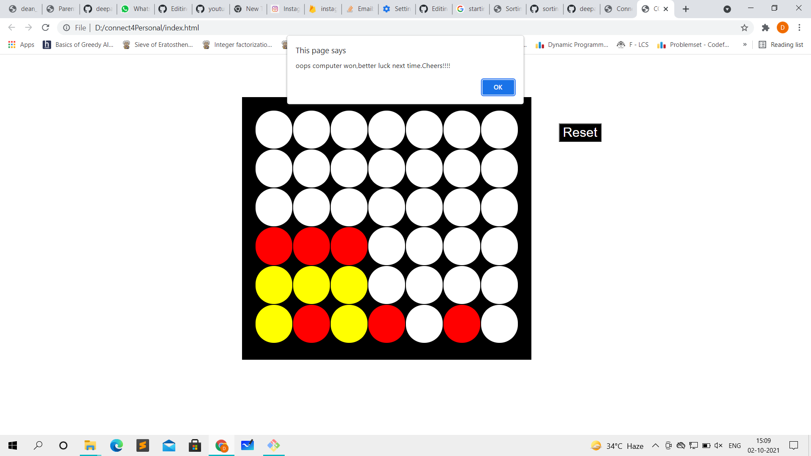

# Connect Four Game

A two person game in which you have to choose one color and fill four consecutive blocks to win. Trained AI to play against humans.
Algorithms used - Minimax algorithm, Alpha Beta pruning


# Technology used


#### Clone the project

```
$ git clone https://github.com/deepanshusingh-hub/connect_four_game/
```

#### Install dependencies

```
$ cd connect_four_game

```



